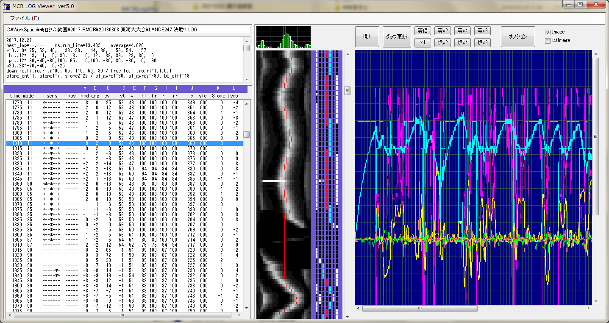

# MCRLogViewer
マイコンカーのログビュアー

## 概要

　ロボットをプログラムによって制御する場合、内部の様子を知ることが効率的なデバッグには欠かせない。とりわけマイコンカーは高速で移動し、10 数秒で動作が完了するので、肉眼による観察のみでは一瞬の間に何が起こったのかを正確に掴むことはほぼ不可能である。よって、走行中の状態をマイクロSDに記録しておき、走行後にそれを解析するのが効率的である。

　走行中は肉眼で走行を観察し、同時にカメラで動画を撮影しておき、走行が終了すると動画を再生し、コマ送りで何度も挙動を観察しながら、記録されたログと見比べて、「センサのここが反応したときに、右後のブレーキをもう少し強めにかけてみると、こういう動きになるかも。」「このタイミングで前の外側のブレーキを緩めるとグリップが回復するかも。」といった次の一手を考え、それをプログラムに反映して次の走行を開始する。といった感じで、一回一回の走行を無駄にしないことが大切である。これらの一連の作業を繰り返すことによって、「安定した」プログラムに熟成していく。

