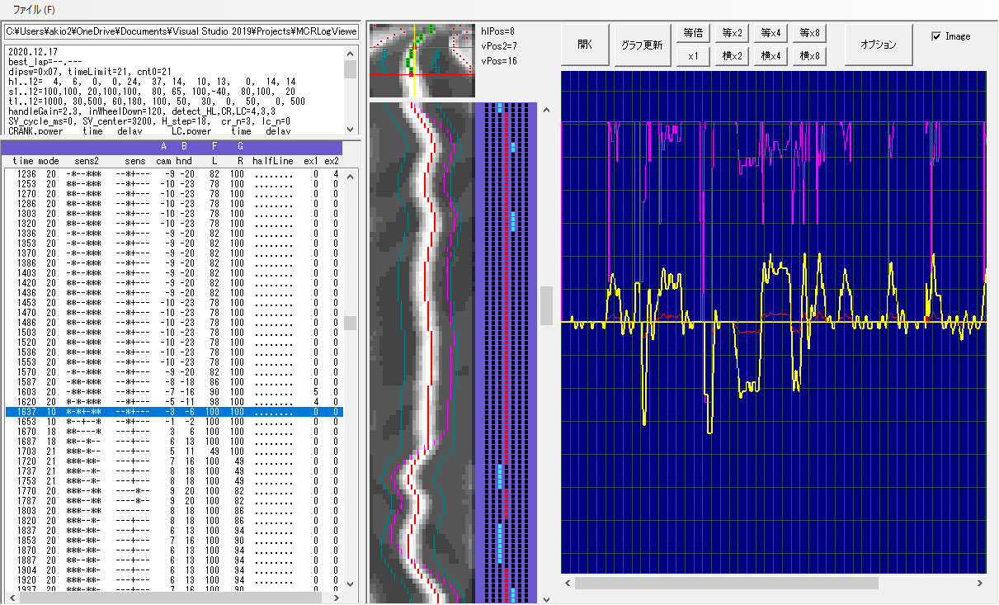

# MCRLogViewer
マイコンカーのログビュアー

## 概要

　ロボットを制御するプログラム開発の際は、内部の様子を知ることが効率的なデバッグには欠かせません。とりわけマイコンカーは高速で移動し、10 数秒で動作が完了するので、肉眼による観察のみでは一瞬の間に何が起こったのかを正確に掴むことはほぼ不可能です。よって、走行中の状態をマイクロSD等にに記録しておき、走行後にそれを解析するのが効率的です。

　走行中は肉眼で走行を観察し、同時にカメラで動画を撮影しておき、走行が終了すると動画を再生し、コマ送りで何度も挙動を観察しながら、記録されたログと見比べて、「センサのここが反応したときに、右後のブレーキをもう少し強めにかけてみると、こういう動きになるかも。」「このタイミングで前の外側のブレーキを緩めるとグリップが回復するかも。」といった次の一手を考え、それをプログラムに反映していきます。

　これらの一連の作業の繰り返しを少しでも楽に行うために開発しました。

備考：
・このソフトウェアは，誰でも自由に使用・改変・再配布できます。
・このソフトウェアを使用したことで生じた損害については責任を負いません。
